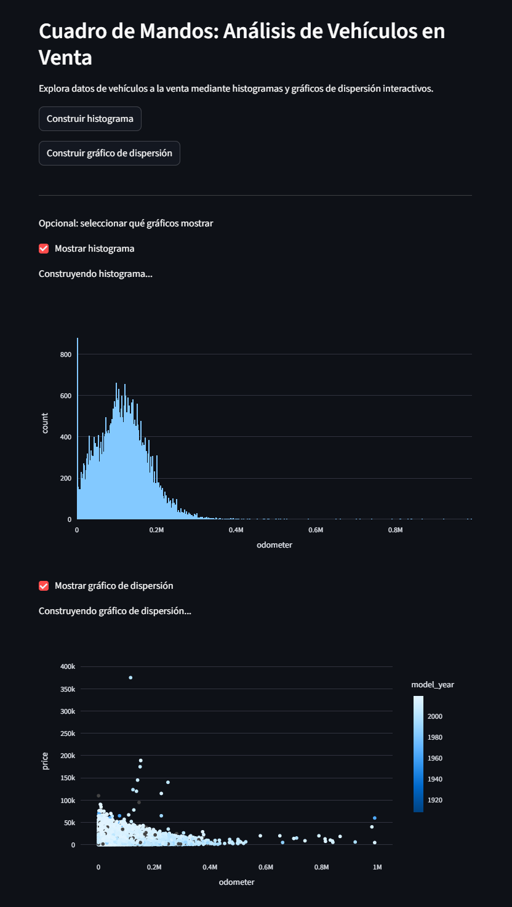

# 🚗 Cuadro de Mandos: Análisis de Vehículos en Venta

## Descripción

Aplicación web interactiva desarrollada con Streamlit para explorar información de vehículos usados mediante visualizaciones dinámicas.

El proyecto permite analizar el comportamiento de variables como el kilometraje y el precio de los vehículos, facilitando la identificación de tendencias y patrones mediante gráficos interactivos.

## Vista previa

## Funcionalidades

- Visualización interactiva de datos.
- Histograma del kilometraje de los vehículos.
- Gráfico de dispersión entre precio y kilometraje.
- Controles para mostrar u ocultar visualizaciones.
- Exploración de tendencias mediante gráficos interactivos.

## Tecnologías utilizadas

- Python
- Pandas
- Streamlit
- Plotly Express

## Archivos del proyecto

- `app.py`
- `vehicles_us.csv`
- `requirements.txt`
- `notebooks/`

## Objetivo

Desarrollar una aplicación web sencilla que facilite el análisis exploratorio de datos mediante visualizaciones interactivas.
